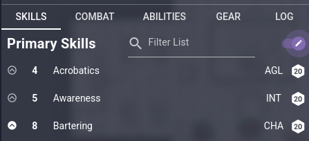
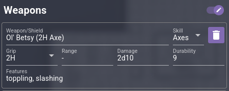
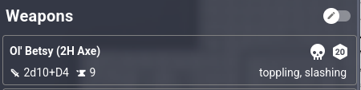
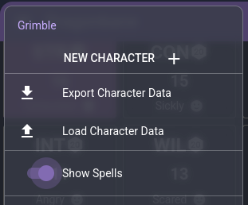

# Dragonbane Character Sheet

A character sheet app for Dragonbane with built-in dice rolls, boons and banes, rest, advancement etc.

**Your character data is stored in your browser's local storage so be sure to export it often so that nothing is lost if your browser data is wiped. The export button is in the left drawer menu.**

## Features

- Automatically calculates Base Chance for skills, number of spells preparable, weight of coins carried etc.

- Automatically mark skills for advancement on a Dragon or Demon roll and log the last 50 roll notifications in the LOG tab.

- Marks baned skills clearly and accounts for armour related banes.

- Roll weapon attacks directly from the Combat tab

- Spend WP directly from the abilities tab when using spells or heroic abilities

## Getting Started

When creating a new character click the edit toggle at the top of the skills list. This allows you to set skills to Trained by clicking the chevron left of the skill name.

The same applies on the COMBAT tab. Use the edit toggle to add or remove weapons. Turn off edit to be able to roll attacks directly from the weapons summary

In the above example note the skull next to the D20 icon on the right. This indicates that relevant attribute has a bane and will be accounted for in the dice roller.

You can click any D20 icon to open the dice roller with the relevant attribute, skill, or ability loaded and set up.

On the ABILITIES tab you can add Heroic abilities and Spells. If your character isn't a spell caster you can disable the Spells section in the left drawer menu.

The GEAR tab is fairly self-explanatory. It shows your wealth (gold, silver, copper). Your inventory with its limit auto-calculated from your Strength and a checkbox to increase it by 2 if you happen to have a backpack.

Lastly the LOG tab keeps a record of your last 50 roll notifications. These are only logged if you use the built-in dice roller.

For help and/or to raise bug reports you can contact the author in the Owlbear Rodeo discord (@tiberianpun) or use the github repository at https://github.com/nboughton/dragonbane
